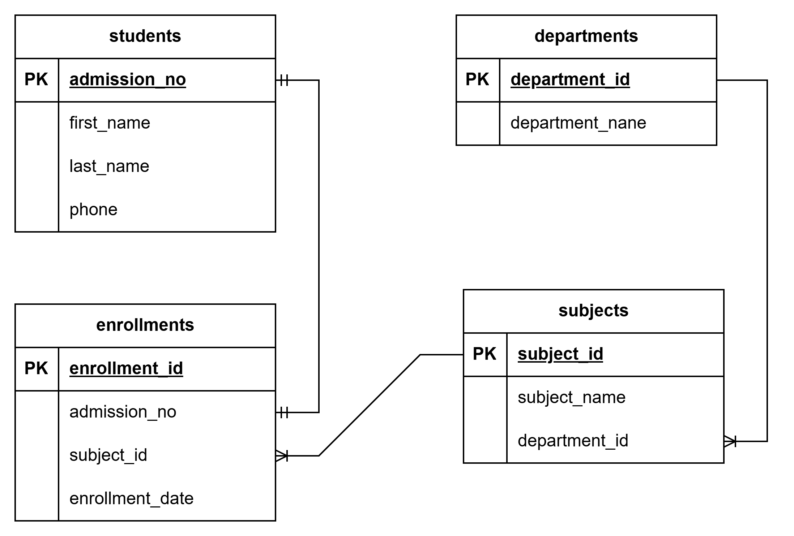

# Student Record Database

This project implements a simple **Student Record Management System** using SQL. It captures the structure of a typical academic institution's records by storing information about students, departments, subjects, and student enrollments.

## Description

This project implements:
- Student information management
- Department and subject categorization
- Subject enrollments per student
- Relational links using foreign keys

Perfect for schools or institutions looking to store academic data in a normalized relational database format.

---

# Features



## Setup

Follow these steps to set up and run the project:

1. **Create the database:**

   ```sql
   CREATE DATABASE StudentRecords;
   USE StudentRecords;
